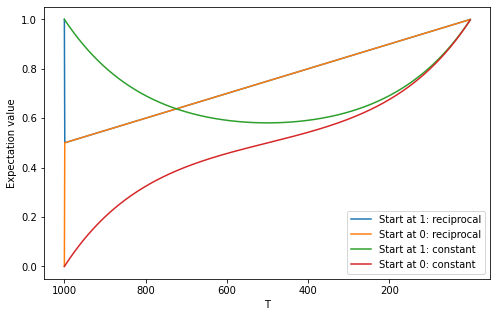

# BDDPM
Simple script to run a binary diffusion model for binarised MIDI generations.

# Introduction
Denoising Diffusion Probabilistic Models (DDPMs) describe a class of directed graphical models that leverage Markov chains analogously to diffusion processes to generate samples from complex data distributions.

They were first introduced in the 2015 paper [``Deep Unsupervised Learning using Nonequilibrium Thermodynamics"](https://arxiv.org/abs/1503.03585) by Sohl-Dickstein et al., where they were used to generate images. However, in the years after, they went largely ignored in favour of the two prominent image generation architectures at the time: [Generative Adversarial Networks (GAN)](https://arxiv.org/abs/1406.2661) and [Variational Autoencoders (VAE)](https://arxiv.org/abs/1906.02691), that were introduced the year prior. As of the writing of this essay (July 2021), these papers have 32343 and 15003 citations, respectively, as opposed to the DDPM model, which has only 153. Nevertheless, the topic has recently found a resurgence when [Ho et al.](https://arxiv.org/abs/2006.11239) showed DDPMs could match GANs in terms of Inception score and FID. The flurry of research that followed this paper has seen DDPMs applied to different domains, such as [speech](https://arxiv.org/abs/2009.09761), [music](https://arxiv.org/abs/2103.16091) and [audio up-sampling](https://arxiv.org/abs/2104.02321). In addition, they have been generalised to different distributions, like [Poisson and Gaussian mixture](https://arxiv.org/abs/2106.07582), and [continuous diffusion processes](https://arxiv.org/abs/2011.13456).

In this essay, we will explore DDPMs with a binomial distribution and their application to MIDI generation. In the next chapter, we will introduce DDPMs in general. Then in chapter 3, we will derive them for Binomial Markov chains and explore how they work. Chapters 4 and 5 describe our experiments with these and the results, respectively. Finally, in chapter 6 a conclusion is provided.

# DDPM
DDPMs can be used to generate new data by sampling from a tractable data distribution such as a standard Gaussian distribution and then repeatedly apply Markov diffusion kernels to let this initial sample drift towards a sample from the data distribution. The reverse process does exactly the opposite, it starts with a sample from the data distribution, i.e. an image or audio sample, and uses inverse Markov kernels to slowly add noise to it until it becomes indistinguishable from random noise. These processes are demonstrated in Figure \ref{fig1} below. The left-to-right direction describes the data generating process and the right-to-left direction depicts the process of turning an image into random noise.

*Figure 1: DDPM forward and backward process. Taken from [Ho et al., 2020](https://arxiv.org/abs/2006.11239)*

## Forward Process
In more mathematical terms, during the forward process the data distribution, denoted by $q(x^0)$ is transformed gradually into the analytically tractable, well-behaved distribution $\pi(x^T)$ by repeatedly applying the Markov kernel $q(x^t|x^{t-1}; \beta_t)$ a total of $T$ times, where $\beta_t$ is the rate of diffusion. A single step in this process, which takes state $x^{t-1}$ and computes the next state $x^t$ is

$q(x^{t+1}) = \int dx^t q(x^t|x^{t-1}; \beta_t)  q(x^{t})$,

where the integral can be replaced by a sum for discrete distributions, as is the case for binomial DDPMs. This corresponds to the right-to-left direction in Figure 1 above and ends in $\pi(x^T) = p(x^T)$. In general the $\beta_t$ are learnable parameters, but computations are significantly simplified when they are kept fixed, as we will see. It is common in the literature to do so. Sohl-Dickstein et al. note that fixing $\beta_t$ is as effective as learning them.

## Reverse Process
The Markov chain in the data generating direction is correspondingly called the reverse process and results in samples from the data distribution. The reverse Markov kernels are parameterised by $\theta_t$, which are computed using a deep neural network. This allows for information to travel between the different dimensions of the data, as opposed to the forward process, in which all the dimensions are treated independently. In the continuous limit, i.e. a small diffusion rate, for both Binomial and Gaussian kernels [the reverse process has the same functional form as the forward process](https://projecteuclid.org/ebooks/berkeley-symposium-on-mathematical-statistics-and-probability/On-the-Theory-of-Stochastic-Processes-with-Particular-Reference-to/chapter/On-the-Theory-of-Stochastic-Processes-with-Particular-Reference-to/bsmsp/1166219215).

### Algorithm: Reverse process

**Result**: Sample from data distribution

1. Sample $x^T \sim \pi(x^T)$
2. **for** $t = T, T-1, \dots, 1$ **do**
    1. Compute $\theta_t$
    2. Sample $x^{t-1} \sim p_{\theta_t}(x^{t-1}|x^t)$
3. **Return** $x^0$

# Training
The log-likelihood of DDPMs is given by

$L = E_\text{data}\left[\log p(x^0)\right] = \int dx^0 q(x^0) \log p(x^0).$ [1]

This in integral is naively intractable. Therefore, we must apply some mathematical tricks to it to get an expression with which we can work. The first step is to write $p(x^0)$ as the relative probability of the forward and reverse trajectories, weighted by the probabilities of the forward trajectories:

$p(x^0) = \int dx^1 \cdots dx^T q(x^1, \dots, x^T|x^0) \frac{p(x^0, \dots, x^T)}{q(x^1, \dots, x^T|x^0)}.$

Secondly, we can write these joint distributions in terms of a product of Markov kernels:

$q(x^1, \dots, x^T|x^0) = \prod_{t=1}^T q(x^t|x^{t-1}, x^0) = \prod_{t=1}^T q(x^t|x^{t-1}),$

$p(x^0, \dots, x^T) = p(x^T) \prod_{t=1}^T p(x^{t-1}|x^t),$

where we used the Markov property in the first row. This yields the expression

$p(x^0) = \int dx^1 \cdots dx^T q(x^1, \dots, x^T|x^0) p(x^T)\prod_{t=1}^T \frac{p(x^{t-1}|x^t)}{q(x^t|x^{t-1})}.$

Note that each of the term in the product is the ratio between a forward step at $t-1$ and its corresponding backward step.

We then plug this into Equation [1] and use Jensen's inequality to get an expression with the logarithm inside the integrals. This results in a tractable expression at the cost of introducing an inequality. However, optimising the resulting quantity, which is called the Evidence Lower BOund (ELBO), is an effective way to yield results.

$L \geq K = \int dx^0 \cdots dx^T q(x^0, \dots, x^T)\log \left(p(x^T)\prod_{t=1}^T \frac{p(x^{t-1}|x^t)}{q(x^t|x^{t-1})}\right).$

Finally, to make the denominators and numerators in the fractions depend on the same state, we use Bayes' rule to write

$q(x^{t-1}|x^t, x^0) = \frac{q(x^t|x^{t-1})q(x^{t-1}|x^0)}{q(x^|x^0)}.$ [2]

This allows us to express the ELBO in terms of Kullback–Leibler divergences:

$K = E_q\left[\log \left(\prod_{t=1}^T \frac{p(x^{t-1}|x^t)}{q(x^{t-1}|x^t, x^0)}\right)\right] + \text{c.t.} = -\sum_{t=2}^T E_{q(x^0, x^t)}\left[D_\text{KL}(q(x^{t-1}|x^t, x^0)||p(x^{t-1}|x^t))\right] + \text{c.t.}.$

Sampling from $q(x^0, x^t)$ is done by first sampling from $q(x^0)$ and then using that to sample $x^t \sim q(x^t|x^0)$. Instead of optimising the entire chain, we randomly select time steps. Therefore, the final training algorithm is:

### Algorithm: Training Process

**Result:** Converged DDPM

**While** not converged:
- Sample $x^0$ from $q(x^0)$
- Sample $t$ from $\text{Uniform}(1, \dots, T)$
- Compute $\text{Loss} = T \cdot D_\text{KL}(q(x^{t-1}|x^t, x^0)||p(x^{t-1}|x^t))$
- Take gradient step with $\text{Loss}$

# Binomial Markov Chains
We define the binomial distribution $B(x^t|x^{t-1}(1-\beta_t) + \beta_t/2)$ at step $t$, which governs the transition probabilities from state $x^{t-1}$ to $x^t$. Note the two edge cases for $\beta_t$: if $\beta_t = 0$, the distribution becomes $B(x^t|x^{t-1})$, which means that the next state is equal to the current state: $x^t = x^{t-1}$. At the other end $\beta_t = 1$ the distribution for $x^{t} \sim B(x^t|1/2)$ is completely independent of $x^{t-1}$.
The corresponding transition matrix $P$ can be expressed as

$P_t = \begin{Vmatrix}
        1-\beta_t/2 & \beta_t/2\\
        \beta_t/2 & 1-\beta_t/2
    \end{Vmatrix}.$

In accordance with the conditions from Equations 1.3 and 1.4 of chapter III of [``An Introduction To Stochastic Modeling"](https://books.google.de/books/about/An_Introduction_to_Stochastic_Modeling.html?id=UtPgVrVthF8C&redir_esc=y) by Taylor and Karlin, all the elements are greater than or equal to zero and all the rows add up to one.

To compute the $n$-step transition probabilities, starting from state $x^0$, consider first the two-step matrix

$M_2 = \begin{Vmatrix}
        1-\beta_2/2 & \beta_2/2\\
        \beta_2/2 & 1-\beta_2/2
    \end{Vmatrix}\begin{Vmatrix}
        1-\beta_1/2 & \beta_1/2\\
        \beta_1/2 & 1-\beta_1/2
    \end{Vmatrix}= \begin{Vmatrix}
        1-\alpha_2/2 & \alpha_2/2\\
        \alpha_2/2 & 1-\alpha_2/2
    \end{Vmatrix},$

where $\alpha_2 = 1 - (1-\beta_1)(1-\beta_2)$. This relation generalises to any $t \in \{1, \dots, T\}$:

$M_t = \begin{Vmatrix}
        1-\alpha_t/2 & \alpha_t/2\\
        \alpha_t/2 & 1-\alpha_t/2
    \end{Vmatrix},$

with

$\alpha_t = 1 - \prod_{i = 1}^t(1-\beta_i),$

and hence $q(x^t|x^0) = (x^t|x^{t-1}(1-\alpha_t) + \alpha_t/2)$.

We now have all the terms to compute $q(x^{t-1}|x^t, x^0) = q(x^t|x^{t-1})q(x^{t-1}|x^0)/q(x^t|x^0)$ from Equation [2]. This is extremely tedious to solve directly. Instead, consider the probability $q(x^{t-1} = 1|x^0, x^t)$ written as the matrix product

$q(x^{t-1}=1|x^0, x^t) = \begin{pmatrix}
1-x^0\\
x^0
\end{pmatrix}^\top L_t \begin{pmatrix}
1-x^t\\
x^t
\end{pmatrix},$

where $L_t$ is the matrix of probabilities

$L_{ij} = q(x^{t-1}=1|x^0 = j, x^t = i) = \frac{q(x^t = j|x^{t-1}=1)q(x^{t-1}=1|x^0=i)}{q(x^t=j|x^0=i)}$

The vector $[1-x^0, x^0]^\top$ is a one-hot vector which picks out one of the column of this probability matrix $L_t$. Similarly, $[1-x^t, x^t]^\top$ picks out the row. To obtain an expression of the form

$q(x^{t-1}=1|x^0, x^t) = \tilde{L}^t_{00} + \tilde{L}^t_{01}x^0 + \tilde{L}^t_{10}x^t + \tilde{L}^t_{11}x^0x^t,$ [3]

note that the binomial vectors can be decomposed as

$\begin{pmatrix}
    1-x^t\\
    x^t
\end{pmatrix} = \begin{pmatrix}
1 & -1\\
0 & 1
\end{pmatrix}\begin{pmatrix}
1\\
x^t
\end{pmatrix}$

and therefore

$\tilde{L}^t = \begin{pmatrix}
1 & -1\\
0 & 1
\end{pmatrix}^\top L^t \begin{pmatrix}
1 & -1\\
0 & 1
\end{pmatrix}$

encodes the probabilities in the form of Equation [3]. Using the fact that $L^t_{00} + L^t_{11} = L^t_{01} + L^t_{10} = 1$, the following expression for $\tilde{L}^t$ can be calculated:

$\tilde{L}^t =
\begin{pmatrix}
        1 - L^t_{11} & L^t_{11}+L^t_{01}-1\\
        L^t_{11} - L^t_{01} & 0
    \end{pmatrix}.$

Hence

$q(x^{t-1}|x^0, x^t) = B(x^{t-1}|1 - L^t_{11} + (L^t_{11}+L^t_{01}-1)x^0 + (L^t_{11} - L^t_{01})x^t)$

and

$\text{Loss}^{t-1} = -(1 - x^0 + L^t_{11}(x^0 + x^t -1) + L^t_{01}(x^0 - x^t))\log \theta_t - (x^0 - L^t_{11}(x^0 + x^t -1) - L^t_{01}(x^0 - x^t))\log (1-\theta_t) + \text{c.t.},$

where

$L^t_{11} = \frac{2-\alpha_{t-1}}{2-\alpha_t}(1-\beta_t/2)$ and $L^t_{01} = \frac{ 2-\alpha_{t-1}}{2\alpha_t}\beta_t.$

## Diffusion Rate
It is important to choose the $\beta_t$ in such a way that the noise gets added gradually. Optimising the noise schedule can have [a significant impact on sample quality](https://arxiv.org/abs/2102.09672). We consider two different noise schedules and their effects:

1. Constant: $\beta^\text{C}_t = \beta \in [0, 1]$
2. Reciprocal: $\beta^\text{R}_t = 1/(T - t + 1)$, as used in [Sohl-Dickstein et al.](https://arxiv.org/abs/1503.03585)

In the case of constant $\beta_t$, find that $\alpha^\text{C}_t = 1 - (1 - \beta)^t$. For reciprocal $\beta_t$, $\alpha_t$ is linear in $t$:

$\alpha^\text{R}_t = 1 - \prod_{i = 1}^t\left(1-\frac{1}{T - i + 1}\right) = 1 - \prod_{i = 1}^t\frac{T-i}{T - i + 1} = 1 - \frac{T-t}{T} = \frac{t}{T}.$

To illustrate this, see Figure 2 below, which shows the value of $\alpha_t$ for $T = 1000$ and $\beta^\text{C}_t = 0.005$.

*Figure 2: Value of $\alpha_t$ at different time steps*

It can be seen that constant $\beta^\text{C}_t$ results in an $\alpha^\text{C}_t$ that grows quickly in the beginning and slows down towards the end. Note that reciprocal $\alpha^\text{R}_t$ ends exactly at 1, whereas constant $\alpha^\text{C}_t$ ends at 0.9933. It is important to choose $\beta$ to be small enough to ensure smooth transitions but large enough that $\alpha^\text{C}_T$ approaches 1.

To gain insight into the conditional forward process as determined by the Markov kernels $q(x^{t-1}|x^0, x^t)$, we have plotted the expectation value of $x^t$ for both $x^T = 0$ and $x^T = 1$, and with $x^0 = 1$. This is shown in Figure 3 below.

*Figure 3: Expectation value of $x^t$ at different time steps for the conditional forward process*

The blue and orange lines represent the average value of $x^t$ of processes of $x^T$ that starts at 1 and 0 respectively, with reciprocal $\beta^\text{R}_t$, and similarly for the red and green lines for constant $\beta^\text{C}_t$. In the case of reciprocal $\beta^\text{R}_t$, the expectation value of processes that start at 0 and 1 jump very sharply and abruptly to 0.5 and continue from there linearly to the value of $x^0 = 1$. The expectation values for constant $\beta^\text{C}_t$ evolve much more smoothly. Interestingly enough, the green line, corresponding to $x^T = 1$ starts and ends at the same value but is closer to pure randomness in between. Because the constant noise schedule results in smoother curves, we used this for our experiments.

# MIDI
MIDI stands for Musical Instrument Digital Surface and is a standarised communications protocol for recorded music. Sounds are encoded by different instrument, pitch and velocity, which corresponds to how loud a tone is to be played. A typical MIDI file consists of several tracks, up to 16 different ones, one for each instrument. Typically one of these is a percussion instrument, for which the 10th channel is reserved, whereas the rest are other instruments, such as piano, guitar, strings, ensemble, brass and sound effects. There are 47 different percussion instruments and 128 others. The tempo indicates the number of quarter notes that are played per minute and the length of each quarter note is determined by the resolution parameter.

For our experiments, we removed the percussion track and overlaid the others on top of each other and let them be played by a piano. This resulted in a single track per song. Furthermore, we binarised the individual notes, to make them only take on the values 0 and 1. This was to make them suitable for our binomial DDPM. These modifications reduces the sound quality somewhat, but for the purposes of our experiment it retained enough of the intrinsic characteristics to yields valuable results. Below in Figure 4 is an example.

*Figure 4: Sample of MIDI sequence of the song ``Livin' on a Prayer"*

# Dataset
For our experiments, we used the [composing AI dataset](https://composing.ai/dataset), consisting of 77153 songs, ranging from classical music to pop music to folk tunes. These songs were preprocessed using the steps described above, resulting in binary data of 128 note channels and time lengths of several hundred steps, depending on the length of the song. They were then converted and stored as binary tensors, which resulted in a dataset of about 10 GB.

# Model
The model that we used was based on a pre-trained [GPT-2 model](https://openai.com/research/language-unsupervised) from [HuggingFace](https://arxiv.org/abs/1910.03771). Recent research has shown that pre-trained language models possess the ability to transfer well to different tasks and modalities from other domains such as image recognition and algorithmic computations. We added a linear projection layer for the input and output, as well as positional embeddings at each layer. The positional embeddings were calculated as

$P^t = \left[\cos \frac{2\pi \cdot t}{T+1}, \sin \frac{2\pi \cdot t}{T+1}, \cos \frac{2\pi \cdot 2 t}{T+1}, \sin \frac{2\pi \cdot 2 t}{T+1}, \dots, \cos 2\pi  t, \sin 2\pi t\right]^\top$

and projected down to the hidden size of the model. During training we froze the parameters of the pre-trained model during the initial five epochs, only training the input and output layers, and the projection of the positional embeddings. After this, we unfroze all parameters and continued training.

# Results and Conclusion
As far as we know, there are no algorithmic methods that can quantify the quality of the results in a way to compare them with other MIDI sequences, since most methods assume an underlying Gaussian distribution, such as the [Overlapping Area metric](https://arxiv.org/abs/2103.16091). Instead, we will describe them in a more subjective manner, leaving the results to be judged by the reader (see attached files for generated music samples). Below two samples of generated MIDI sequences are shown.

*Figure 5: Two generated MIDI sequences*

The density of notes is similar those of the original MIDI sequences from the training dataset. Furthermore, there appear to be longer and shorter notes, as indicated by different length in bars. Most notes lie within the middle of the range, as is common for real music too. In the attached files, these corresponding wav files of these MIDI sequence can be heard. People that we've shown the recordings to have described them as 'futuristic'.